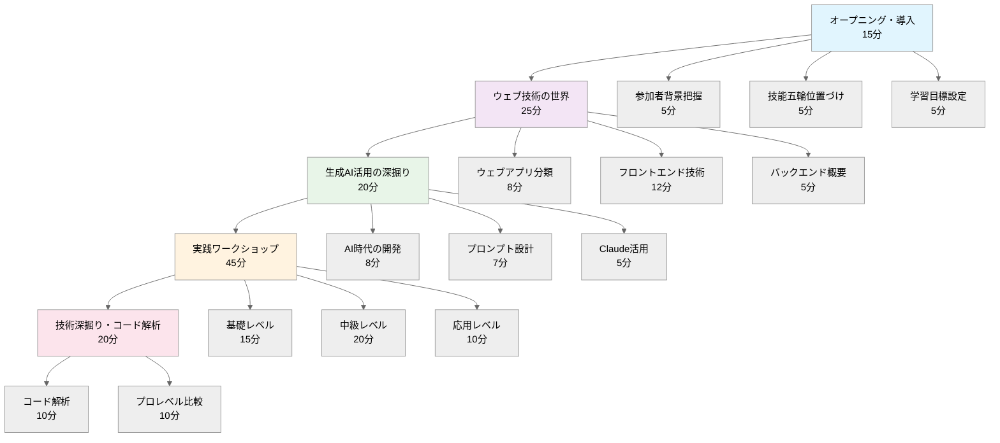
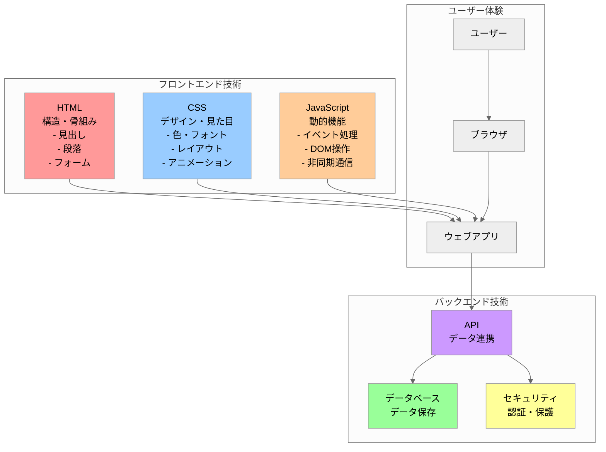
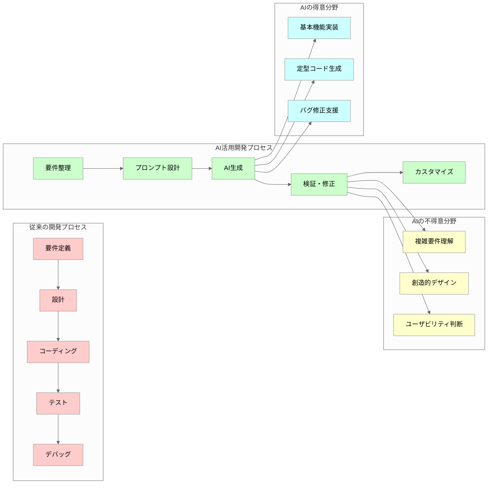
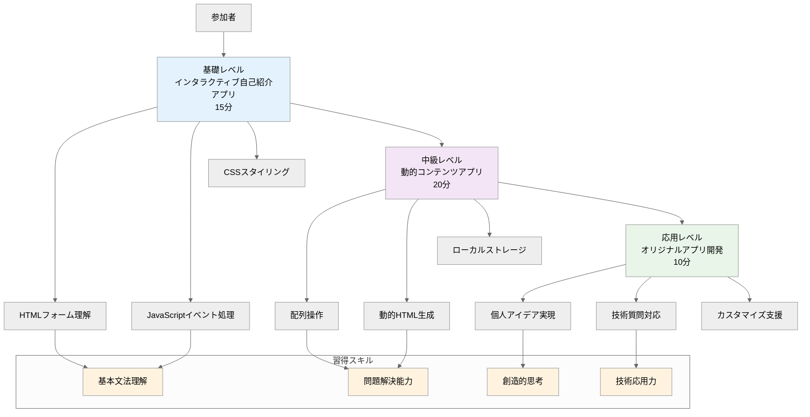
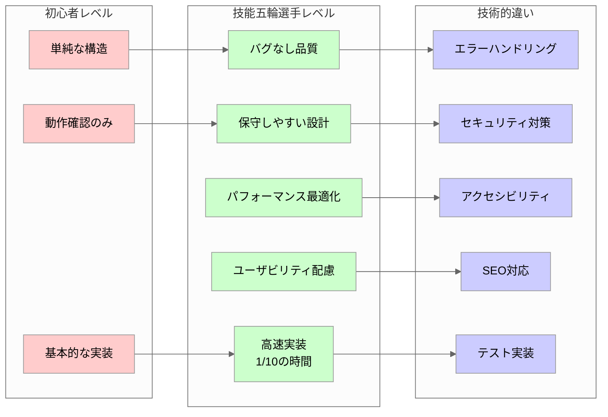

# 技能五輪ウェブデザイン競技体験ワークショップ 詳細フレームワーク

## ワークショップ全体の流れ



## 1. オープニング・導入（15分）

### 1.1 参加者の背景把握（5分）
**アイスブレイク質問**
- 「普段使っているアプリで一番好きなものは？」
- 「そのアプリのどこが気に入っている？」
- 「プログラミングの経験はある？」
- 「ウェブサイトを作ったことはある？」

**目的**: 参加者のレベルを把握し、説明の深度を調整

### 1.2 技能五輪の位置づけ（5分）
**技能五輪とは**
- 「技能のオリンピック」
- 22歳以下の若者が技術を競う国際大会
- ウェブデザイン競技の歴史と重要性
- 日本の過去の成績と世界レベル

**なぜウェブデザインが重要か**
- デジタル社会の基盤技術
- あらゆる業界で必要とされるスキル
- 創造性と技術力の両方が求められる

### 1.3 今日の学習目標の詳細設定（5分）
**3つの学習目標**
1. **体験目標**: 実際にウェブアプリを作って動かす
2. **理解目標**: ウェブ技術の基本構造を理解する
3. **発見目標**: 技能五輪選手のすごさを実感する

## 2. ウェブ技術の世界（25分）

### 2.1 ウェブアプリケーションの分類と特徴（8分）

**静的ウェブサイト vs 動的ウェブアプリ**
- **静的サイト**: 情報を表示するだけ（会社のホームページなど）
- **動的アプリ**: ユーザーの操作に反応する（SNS、ゲーム、ショッピングサイト）

**ウェブアプリの種類**
- **SPA（Single Page Application）**: Gmail、Twitter
- **PWA（Progressive Web App）**: スマホアプリのような体験
- **レスポンシブアプリ**: PC、タブレット、スマホ対応

**実例紹介**
- YouTube: 動画再生、コメント、検索機能
- Instagram: 写真投稿、フィルター、いいね機能
- Google Maps: 地図表示、ルート検索、リアルタイム更新

### 2.2 フロントエンド技術の詳細解説（12分）

## ウェブ技術の構造



**HTML（HyperText Markup Language）**
```html
<!DOCTYPE html>
<html>
<head>
    <title>ページのタイトル</title>
</head>
<body>
    <h1>見出し</h1>
    <p>段落</p>
    <button>ボタン</button>
</body>
</html>
```
- **役割**: ウェブページの骨組み・構造
- **要素**: 見出し、段落、画像、リンク、フォーム
- **セマンティック**: 意味のあるマークアップの重要性

**CSS（Cascading Style Sheets）**
```css
body {
    background-color: #f0f0f0;
    font-family: Arial, sans-serif;
}
button {
    background-color: #007bff;
    color: white;
    padding: 10px 20px;
    border: none;
    border-radius: 5px;
}
```
- **役割**: 見た目・デザインの制御
- **主要概念**: セレクタ、プロパティ、値
- **レスポンシブデザイン**: 画面サイズに応じた表示調整
- **アニメーション**: 動きのあるデザイン

**JavaScript（プログラミング言語）**
```javascript
function greetUser() {
    const name = document.getElementById('nameInput').value;
    alert('こんにちは、' + name + 'さん！');
}
```
- **役割**: インタラクティブな動作の実装
- **主要概念**: 変数、関数、イベント処理
- **DOM操作**: HTMLを動的に変更
- **非同期処理**: サーバーとの通信

### 2.3 バックエンド技術の概要（5分）

**サーバーサイド技術**
- **データベース**: ユーザー情報、投稿データの保存
- **API**: フロントエンドとバックエンドの橋渡し
- **セキュリティ**: ユーザー認証、データ保護

**技能五輪での扱い**
- フロントエンド中心だが、バックエンドの理解も必要
- データの流れを理解した設計が求められる

## 3. 生成AI活用の深掘り（20分）

### 3.1 AI時代のウェブ開発（8分）

## AI活用開発プロセス比較



**従来の開発プロセス**
1. 要件定義（何を作るか決める）
2. 設計（どう作るか設計する）
3. コーディング（実際にコードを書く）
4. テスト（動作確認）
5. デバッグ（問題修正）

**AI活用の開発プロセス**
1. 要件定義（AIに伝える内容を整理）
2. プロンプト設計（AIへの指示を作成）
3. AI生成（コード自動生成）
4. 検証・修正（生成物の確認と調整）
5. カスタマイズ（細かい調整）

**AIの得意・不得意**
- **得意**: 基本的な機能実装、定型的なコード生成
- **不得意**: 複雑な要件理解、創造的なデザイン判断

### 3.2 効果的なプロンプト設計（7分）

**良いプロンプトの5つの要素**
1. **目的の明確化**: 何を作りたいか
2. **機能の詳細**: どんな動作をするか
3. **デザイン要件**: 見た目の希望
4. **技術的制約**: 使用技術の指定
5. **ユーザー体験**: 使いやすさの観点

**プロンプト例の比較**

**悪い例**
```
ウェブアプリを作って
```

**良い例**
```
以下の仕様でタスク管理ウェブアプリを作成してください：

【機能要件】
- タスクの追加、削除、完了マーク
- 優先度の設定（高・中・低）
- 期限の設定と表示
- 完了済みタスクの非表示機能

【デザイン要件】
- モダンでシンプルなデザイン
- 青を基調とした配色
- スマートフォンでも使いやすいレスポンシブデザイン

【技術要件】
- HTML、CSS、JavaScriptのみ使用
- ローカルストレージでデータ保存
- 1つのHTMLファイルで完結
```

### 3.3 Claude活用のベストプラクティス（5分）

**Claudeの特徴**
- **Artifacts機能**: コードを実行可能な形で表示
- **安全性**: 教育用途に適した設計
- **対話性**: 段階的な改良が可能

**効果的な使い方**
1. **段階的開発**: 基本機能→追加機能→デザイン改良
2. **具体的フィードバック**: 「もっと良く」ではなく「ボタンを大きく」
3. **エラー対応**: エラーメッセージをそのまま伝える

## 4. 実践ワークショップ（45分）

## 学習レベル段階図



### 4.1 基礎レベル：インタラクティブ自己紹介アプリ（15分）

**学習目標**
- HTMLフォームの理解
- JavaScriptイベント処理の体験
- CSSスタイリングの効果確認

**段階的プロンプト**

**Step 1: 基本構造**
```
自己紹介ウェブアプリを作成してください。

【必要な機能】
- 名前入力フィールド
- 年齢選択（ドロップダウン）
- 趣味入力（テキストエリア）
- 「自己紹介する」ボタン
- 結果表示エリア

【動作】
ボタンを押すと「はじめまして！私は[名前]です。[年齢]歳で、趣味は[趣味]です。」と表示

【デザイン】
- 中央揃えのレイアウト
- 爽やかな青系の配色
- 読みやすいフォント
```

**コード解説ポイント**
- `<input type="text">`: テキスト入力
- `<select>`: ドロップダウン選択
- `<textarea>`: 複数行テキスト
- `addEventListener`: イベント処理
- `getElementById`: 要素の取得

### 4.2 中級レベル：動的コンテンツアプリ（20分）

**学習目標**
- 配列操作の理解
- 動的HTML生成の体験
- ローカルストレージの活用

**プロンプト例：簡単なメモアプリ**
```
メモ管理ウェブアプリを作成してください。

【機能要件】
- メモの追加（タイトルと内容）
- メモ一覧の表示
- 個別メモの削除
- メモの編集機能
- データの永続化（ローカルストレージ）

【UI要件】
- 上部にメモ追加フォーム
- 下部にメモ一覧をカード形式で表示
- 各カードに編集・削除ボタン
- レスポンシブデザイン

【デザイン要件】
- Material Designライクな見た目
- グリーン系の配色
- ホバー効果とアニメーション
- アイコンの使用（絵文字でも可）
```

**技術解説ポイント**
- `localStorage`: データの永続化
- `JSON.stringify/parse`: データの変換
- `createElement`: 動的要素作成
- `forEach`: 配列の繰り返し処理
- CSS Grid/Flexbox: レイアウト

### 4.3 応用レベル：オリジナルアプリ開発（10分）

**参加者主導の開発**
- 各自が作りたいアプリを考案
- プロンプト作成を支援
- 技術的な質問に対応

**アプリアイデア例**
- 簡単な計算機
- おみくじアプリ
- クイズゲーム
- カラーパレット生成器
- BMI計算機
- パスワード生成器

## 5. 技術深掘り・コード解析（20分）

### 5.1 生成されたコードの詳細解析（10分）

**HTML構造の解説**
```html
<!DOCTYPE html>
<html lang="ja">
<head>
    <meta charset="UTF-8">
    <meta name="viewport" content="width=device-width, initial-scale=1.0">
    <title>メモアプリ</title>
</head>
```
- DOCTYPE宣言の意味
- meta要素の役割
- 言語設定の重要性

**CSS設計パターンの解説**
```css
/* BEM記法の例 */
.memo-card {
    background: white;
    border-radius: 8px;
    box-shadow: 0 2px 4px rgba(0,0,0,0.1);
}

.memo-card__title {
    font-size: 1.2em;
    font-weight: bold;
}

.memo-card__button--delete {
    background-color: #ff4757;
    color: white;
}
```
- CSS設計手法（BEM記法）
- レスポンシブデザインの実装
- アニメーションの追加

**JavaScript設計パターンの解説**
```javascript
// モジュールパターンの例
const MemoApp = {
    memos: [],
    
    init() {
        this.loadMemos();
        this.bindEvents();
        this.render();
    },
    
    addMemo(title, content) {
        const memo = {
            id: Date.now(),
            title,
            content,
            createdAt: new Date()
        };
        this.memos.push(memo);
        this.saveMemos();
        this.render();
    }
};
```
- オブジェクト指向的な書き方
- 関数の分割と責任分担
- エラーハンドリング

### 5.2 プロフェッショナルレベルとの比較（10分）

## 初心者 vs プロフェッショナル比較



**技能五輪選手のレベル**
- **速度**: 同じアプリを1/10の時間で作成
- **品質**: バグのない、保守しやすいコード
- **デザイン**: ユーザビリティを考慮した設計
- **最適化**: パフォーマンスを意識した実装

**具体的な違い**

**初心者レベル**
```javascript
function addMemo() {
    var title = document.getElementById('title').value;
    var content = document.getElementById('content').value;
    // 基本的な実装
}
```

**プロフェッショナルレベル**
```javascript
class MemoManager {
    constructor(storageKey = 'memos') {
        this.storageKey = storageKey;
        this.memos = this.loadFromStorage();
        this.observers = [];
    }
    
    addMemo(title, content) {
        // バリデーション
        if (!this.validateInput(title, content)) {
            throw new Error('Invalid input');
        }
        
        const memo = new Memo(title, content);
        this.memos.push(memo);
        this.saveToStorage();
        this.notifyObservers('memoAdded', memo);
        
        return memo;
    }
    
    validateInput(title, content) {
        return title.trim().length