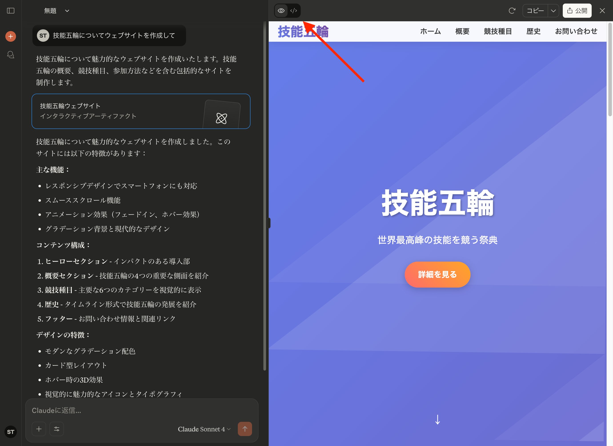

# 「技能五輪・アビリンピック2025」ウェブデザイン職種　競技解説ガイド資料

今回はAIと共に技能五輪を理解していきます。

- **講義担当者**
  - 戸田 駿太
- **経歴**
  - 第60回（2022年）技能五輪全国大会ウェブデザイン職種 金賞
  - 第61回（2023年）技能五輪全国大会ウェブデザイン職種 金賞
  - 第47回技能五輪国際大会（WorldSkills）Web Technologies職種 日本代表
  
国際大会のブログ記事
https://dev.classmethod.jp/articles/worldskills-lyon-2024-experience-report/


## ワークショップの概要

本日は技能五輪ウェブデザイン競技の世界を体験するワークショップです。生成AI（Claude）を活用しながら、実際にウェブアプリケーションを作成し、プロフェッショナルレベルの技術に触れることができます。

## まずはこれを開いて！

**NotebookLM**

https://notebooklm.google.com/notebook/c7d61aae-7667-4403-b995-9222d64f8c49?original_referer=https:%2F%2Fblog.g-gen.co.jp%23&pli=1&authuser=1

ここに技能五輪全国大会ウェブデザイン職種のデータが入っているので、AIとチャットして自由に理解することができます。
先生に質問するより気軽に、正確な情報を提供してくれます。

わからないことがあればAIに質問するを徹底してください！！
これくらいの内容であればAIが全て回答してくれます

### 技能五輪とは
- **「技能のオリンピック」**: 22歳以下の若者が技術を競う国際大会
- **ウェブデザイン競技**: デジタル社会の基盤技術を競う重要な分野
- **世界レベル**: 創造性と技術力の両方が求められる高度な競技

### 技能五輪の階層構造

この3つのレベルがあります。

- 若年者ものづくり競技会
- 技能五輪全国大会
- 技能五輪国際大会

それぞれの大会で出場条件があり、満たせた選手が出場できます。


[技能五輪の公式サイト](https://www.javada.or.jp/jigyou/gino/zenkoku/)

### ウェブデザイン職種とは

**ウェブ上のインターフェース設計・構築を行い、ユーザーに最適な形で情報を提供する技能**を競う職種です。
現代のデジタル社会において、ウェブ技術は情報プラットフォームの中心となっており、非常に重要なスキルとされています。

**求められる能力**
- **要件理解とコミュニケーション**: クライアントの要求を正確に把握する力
- **技術的知識と応用力**: HTML/CSS、JavaScript、PHP、データベース等の幅広い技術
- **多角的な技能**: フロントエンド開発、バックエンド開発、デザイン、セキュリティ対策
- **最新技術への対応**: 数年で変化する業界動向をキャッチアップする力

**全国大会と国際大会の違い**
- **全国大会**: 4つのモジュール、2日間（計8時間30分）
- **国際大会**: 7つのモジュール、4日間、より高度な技能とスピードが要求される

**競技モジュール（全国大会）**
1. **スピードテスト（1時間）**: デザイン・レイアウト・フロントエンド・バックエンドの基本技能を高速で処理
2. **バックエンド（2時間30分）**: PHPフレームワークとデータベースを用いた管理システム構築
3. **フロントエンド・インタラクティブ（2時間30分）**: JavaScriptを中心としたインタラクティブなゲーム開発
4. **マーケティングページ（2時間30分）**: レスポンシブデザインによる商品プロモーションサイト制作


## 今日の学習目標

**体験目標**
実際にウェブアプリを作って動かしてみる

**理解目標**
ウェブ技術の基本構造を理解する

**発見目標**
技能五輪選手のすごさを実感する


## ウェブアプリケーションとは？

**ブラウザ上で動作するアプリのこと**です。スマホアプリをダウンロードしなくても、ブラウザでアクセスするだけで使えるのが特徴です。

**2つのタイプがあります**

**静的ウェブサイト**
- 情報を見るだけのサイト（会社のホームページ、ニュースサイトなど）
- 内容が変わらない、一方向の情報提供

**動的ウェブアプリケーション** 
- ユーザーの操作に反応して内容が変わる
- 双方向のやりとりができる

**身近な例**
- **YouTube**: 動画検索、再生、コメント投稿
- **Instagram**: 写真投稿、フィルター加工、いいね
- **Google Maps**: 地図検索、ルート案内、リアルタイム交通情報
- **オンラインゲーム**: ブラウザで遊べるゲーム
- **ネットショッピング**: 商品検索、カート機能、決済


## ウェブ技術の基本構造

ウェブアプリケーションは主に3つの技術で構成されています：

### HTML（構造・骨組み）
```html
<h1>見出し</h1>
<p>段落</p>
<button>ボタン</button>
```
- ページの骨組みを作る
- 見出し、段落、画像、リンクなどの要素を定義

### CSS（デザイン・見た目）
```css
button {
    background-color: #007bff;
    color: white;
    padding: 10px 20px;
    border-radius: 5px;
}
```
- 色、フォント、レイアウトを制御
- 美しく使いやすいデザインを実現

### JavaScript（動的機能）
```javascript
function greetUser() {
    const name = document.getElementById('nameInput').value;
    alert('こんにちは、' + name + 'さん！');
}
```
- ユーザーの操作に反応する機能
- インタラクティブな動作を実現

## 生成AIで作ってみよう

### ここにアクセス
https://claude.ai

ログイン後はこの画面になると思います。


真ん中のチャットボックスにプロンプト（AIへの命令）を記述します


送信するとAIが回答してウェブサイトを作ってくれます
アーティファクトというものがウェブサイトを表示する機能です。


完成したウェブサイトを確認してみましょう！


ここのボタンでプログラムのコードに切り替えられます


コードを表示した時の画面
ここでウェブサイトはどのように作られているのか確認できます
全て理解して記述できるように訓練しているのが技能五輪の選手たちです


HTML, CSS, JavaScriptがどこで使われているのか見つけましょう


### 効果的なプロンプトの書き方

#### 悪い例
```
ウェブアプリを作って
```

#### 良い例
```
以下の仕様でタスク管理ウェブアプリを作成してください：

【機能要件】
- タスクの追加、削除、完了マーク
- 優先度の設定（高・中・低）
- 期限の設定と表示

【デザイン要件】
- モダンでシンプルなデザイン
- 青を基調とした配色
- スマートフォン対応

【技術要件】
- HTML、CSS、JavaScriptのみ使用
- 1つのファイルで完結
```

### AIの得意・不得意

#### 得意分野
- 基本的な機能の実装
- 定型的なコードの生成
- バグ修正の支援

#### 不得意分野
- 複雑な要件の理解
- 創造的なデザイン判断
- ユーザビリティの判断

## 実践演習の流れ

### 基礎レベル：自己紹介サイト
**作成内容**: 名前・年齢・趣味を入力して自己紹介文を生成
**学習ポイント**: 
- HTMLフォームの使い方
- JavaScriptイベント処理
- CSSスタイリング

### 中級レベル：メモアプリ
**作成内容**: メモの追加・削除・編集機能付きアプリ
**学習ポイント**:
- 配列操作
- 動的HTML生成
- ローカルストレージでのデータ保存

### 応用レベル：オリジナルアプリ
**作成内容**: 各自のアイデアでオリジナルアプリを開発
**アイデア例**:
- 計算機
- おみくじアプリ
- クイズゲーム
- カラーパレット生成器

## 技能五輪選手は何をやっているのか

先ほどAIに書かせたプログラムを全て理解して手で記述してアプリを作っています。
プログラムのコードは一文字ずつ意味があるので理解していないと作成できません。
課題の仕様を全て理解して、それをコードに落とし込んでいます。

## アプリ開発が気になった人への今後の学習ステップ

1. まずはAIを使ってアプリを作る楽しさを知りましょう！
   1. なんでもAIに相談してもらいながら何か作りましょう。
   2. どうやって作っているのか分からなくても大丈夫です。
2. 基礎を固めていきましょう。
   1. 本でも勉強サイトでもなんでもいいです
   2. とにかく勉強して基礎を固めましょう
3. 少しずつ応用を学びましょう
   1. 基礎だけではいいアプリは作れません
   2. より高度な技術を学び、アプリを作るにはどうしたらいいか頭で考えられるようになりましょう
4. ここまで到達してAIが何をしてくれていたのかを理解することができれば立派なエンジニアです。
    1. ここまで楽しめていれば最高のエンジニアになれます
    2. アプリを作るときには喜んでくれる人を想像しながら作るとより良いです
    3. 誰かにアプリで感動を与えましょう

## 最後に

ウェブ技術の世界は広く、常に新しい技術が生まれています。
継続的な学習と実践を通じて、技能五輪選手レベルの技術力を目指しましょう！
